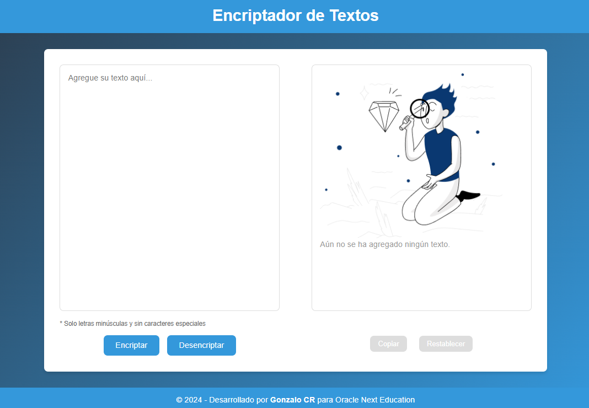
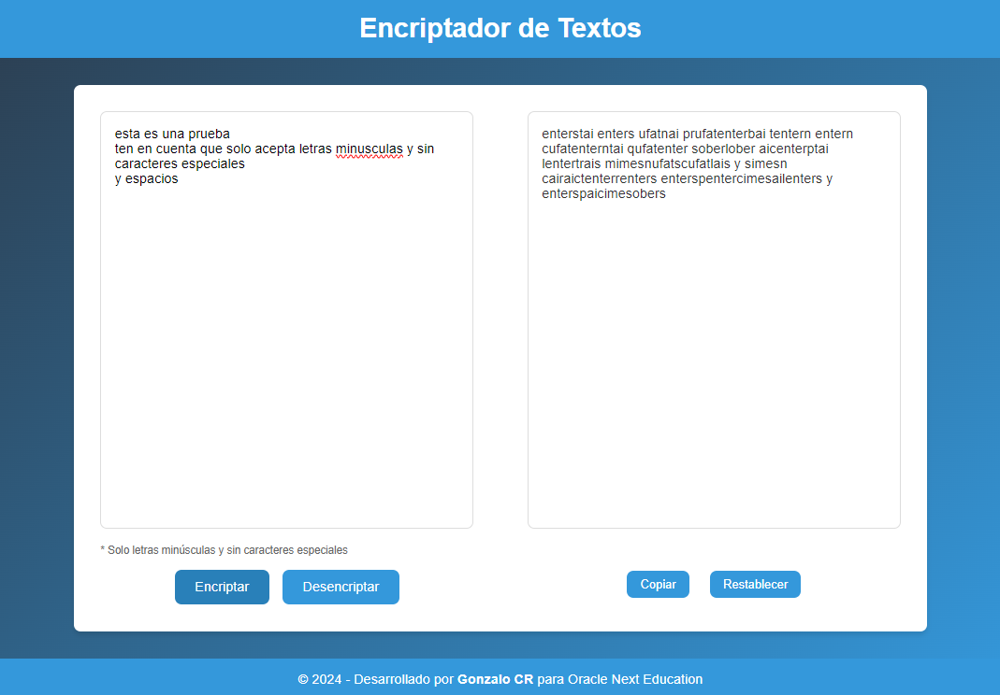
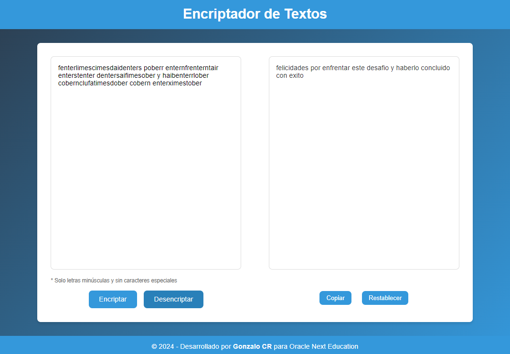

# Proyecto de Encriptación y Desencriptación de Texto

Este proyecto es una implementación sencilla de un sistema de encriptación y desencriptación de texto, desarrollada en JavaScript. Además de las funcionalidades básicas de encriptar y desencriptar, también incluye características útiles como copiar el texto al portapapeles y restablecer la interfaz a su estado original. 

La interfaz de usuario ha sido diseñada utilizando CSS, asegurando un diseño limpio y moderno. El estilo es completamente responsive, lo que significa que se adapta a diferentes tamaños de pantalla, ofreciendo una experiencia óptima tanto en dispositivos móviles como en computadoras de escritorio.

A continuación, se ofrece una descripción detallada de cada una de las funciones del script y su propósito.

## Funciones Principales

### Asignar Texto a Elemento

```javascript
function asignarTextoElemento(elemento, texto) {
    let elementoHTML = document.querySelector(elemento);
    elementoHTML.innerHTML = texto;
}
```

Esta función se encarga de asignar contenido HTML a un elemento específico del DOM. Es útil para actualizar de forma dinámica el contenido de la página.
- `elemento`: El selector del elemento HTML al que se quiere asignar el texto.
- `texto`: El contenido HTML que se va a insertar en el elemento.

### Obtener Texto de Elemento

```javascript
function obtenerTextoElemento(elemento) {
    let elementoHTML = document.querySelector(elemento);
    return elementoHTML.value;
}
```

Esta función obtiene el valor de un campo de entrada específico del DOM. Es esencial para capturar el texto que el usuario introduce en el área de entrada:

- `elemento`: El selector del elemento HTML cuyo valor se desea obtener.
- Retorna: El valor actual del campo de entrada.

### Filtrar Entrada

```javascript
function filterInput(event) {
    const inputText = event.target.value;
    const filteredText = inputText.replace(/[^a-z\s]/g, '');
    event.target.value = filteredText;
}
```

Esta función filtra el texto de entrada del usuario, permitiendo únicamente letras minúsculas y espacios. Esto garantiza que el texto ingresado sea adecuado para el proceso de encriptación.

- `event`:  El evento que desencadena la función, generalmente el evento input del campo de texto.

### Encriptar Texto

```javascript
function encryptText() {
    let input = obtenerTextoElemento('#input-text');
    let encryptedText = input.replace(/e/g, 'enter')
                             .replace(/i/g, 'imes')
                             .replace(/a/g, 'ai')
                             .replace(/o/g, 'ober')
                             .replace(/u/g, 'ufat');
    displayOutput(encryptedText);
    habilitarBotones();
}
```

Esta función encripta el texto proporcionado por el usuario. Reemplaza las vocales con secuencias de caracteres predefinidas para transformar el texto.


- Proceso:

  -  Se obtiene el texto de entrada.
  -  Se reemplazan las vocales según el esquema de encriptación.
  -  Se muestra el texto encriptado en la interfaz.
  -  Se habilitan los botones de acción correspondientes.


### Desencriptar Texto

```javascript
function decryptText() {
    let input = obtenerTextoElemento('#input-text');
    let decryptedText = input.replace(/enter/g, 'e')
                             .replace(/imes/g, 'i')
                             .replace(/ai/g, 'a')
                             .replace(/ober/g, 'o')
                             .replace(/ufat/g, 'u');
    displayOutput(decryptedText);
    habilitarBotones();
}
```

Esta función revierte el proceso de encriptación, devolviendo el texto encriptado a su forma original.

- Proceso:

  -  Se obtiene el texto encriptado.
  -  Se reemplazan las secuencias de caracteres por las vocales originales.
  -  Se muestra el texto desencriptado en la interfaz.
  -  Se habilitan los botones de acción correspondientes.


### Copiar Texto

```javascript
function copyText() {
    let outputText = document.querySelector('#result-text').textContent;
    if (outputText.trim() !== '') {
        navigator.clipboard.writeText(outputText).then(() => {
            alert('Texto copiado al portapapeles');
        }).catch(err => {
            console.error('Error al copiar el texto: ', err);
        });
    } else {
        alert('No hay texto para copiar');
    }
}
```

Esta función permite al usuario copiar el texto encriptado o desencriptado al portapapeles, facilitando su uso en otras aplicaciones o documentos.

- Proceso:

    - Verifica si hay texto para copiar.
    - Utiliza la API del portapapeles para copiar el texto.
    - Muestra una alerta de éxito o error.


### Mostrar Salida

```javascript
function displayOutput(text) {
    let initialContent = document.querySelector('#initial-content');
    let resultText = document.querySelector('#result-text');
    
    initialContent.style.display = 'none';
    resultText.style.display = 'block';
    resultText.textContent = text;
}
```

Esta función maneja la actualización de la interfaz para mostrar el resultado de la encriptación o desencriptación.

- Oculta el contenido inicial de la página.
- Muestra el área de resultados y actualiza su contenido con el texto proporcionado.

### Restablecer Estado

```javascript
function resetState() {
    document.querySelector('#input-text').value = '';
    
    let initialContent = document.querySelector('#initial-content');
    let resultText = document.querySelector('#result-text');
    
    initialContent.style.display = 'block';
    resultText.style.display = 'none';
    resultText.textContent = '';
    
    deshabilitarBotones();
}
```

Esta función restablece la interfaz de usuario al estado inicial, limpiando los campos de entrada y ocultando los resultados previos.

- Limpia el campo de texto de entrada.
- Restablece la visibilidad del contenido inicial.
- Oculta el área de resultados y deshabilita los botones de acción.

### Habilitar y Deshabilitar Botones

```javascript
function habilitarBotones() {
    document.querySelector('.copy-button').removeAttribute('disabled');
    document.querySelector('.reset-button').removeAttribute('disabled');
}

function deshabilitarBotones() {
    document.querySelector('.copy-button').setAttribute('disabled', 'true');
    document.querySelector('.reset-button').setAttribute('disabled', 'true');
}
```

Estas funciones controlan el estado de los botones de copiar y restablecer, habilitándolos o deshabilitándolos según el contexto de la interfaz.


## Inicialización del Proyecto

```javascript
document.addEventListener('DOMContentLoaded', () => {
    document.getElementById('input-text').addEventListener('input', filterInput);
    resetState();
});
```

Cuando el documento se carga por completo, se ejecutan las siguientes acciones:

- `Filtrado de Entrada:` Se añade un listener para filtrar el texto ingresado por el usuario, permitiendo solo letras minúsculas y espacios.
- `Restablecimiento del Estado:` Se asegura que la interfaz comience en su estado inicial, lista para ser utilizada.

 

***
***


### Estado de Inicialización



### Resultado de la Encriptación 



### Desencriptando el mensaje secreto del desafío




***
*** 

\
Este proyecto fue desarrollado para el  Challenges Alura "Desafío Encriptador de Texto" de la formación "Principiante en Programación G7" de ORACLE NEXT EDUCACTION -

#### `GECR 2024`
```
